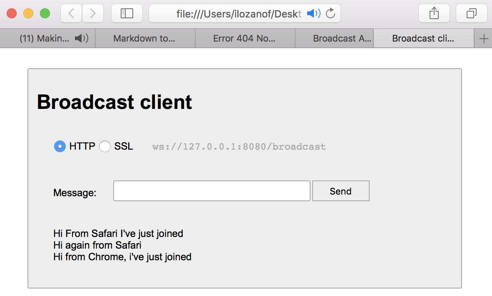

# learning-websocket

This project contains different examples of the use of *Websockets* (see below chapters for explanations of each example).

> **NOTE**: 
> All the following examples make use of an embedded web server, the **Jetty** server. This server is included as a dependency library in *gradle* (see *build.gradle*), and it's needed for all the tests to work.

> The classes *com.ilozanof.learning.websocket.WebsocketHttpServer.java* and *com.ilozanof.learning.websocket.WebsocketSecureServer.java* take care of running this server, and it's used by all the Tests in this project.

## Structure of the examples

### broadcast
In this example, we have:
 * 1 Endpoint in the Server. 
   It keeps track of all the Sessions opened by different clientes, and for each Message it receives, it sends it back to ALL the clients (including the one who sent it).
 * 1 Java Client that sends messages and also works as a Listener for incoming messags from the Server.
 * 1 Web Client, implemented in (HTML + CSS + JS + jQuery). The source code is composed of the following files:
   * *broadcastClient.html*: The HTML containing the user interface
   * *clientCommon.css": Commons styles for all the examples in this project.
   * *clientCommon.js": Commons JS functions
   * messageHandling.js": Implementation of functions responsible for encoding/decoding messages from/to the WebSocket.
   
#### How to test the Server and Java Clients
Just run the tests.

#### How to run the Server and HTML Clients
In this case, we need to run the Server first, and then test the HTML pages. And depending on whether we are testing *HTTP* or *SSL*, there are some minor
 things that we need to be aware of:
 
##### Testing the HTML Client with HTTP
Nothing special needs to be done here, since both Server implementations (*WebsocketHttpSever* and *WebsocketSecureServer*) include HTTP support in the port 8080.
So open the file *src/main/resources/webClient/broadcastClient.html* file in a web browser, that will show the Client pre-configured for HTTP. Now you can type and send messages, 
and they will be displayed below in the page, after being sent to the Server and back to the client. You can open different browsers at the same time, to check that 
the messages are broadcasted to all of them...

* NOTE: If you try to select **SSL** in the Web client, you'll get an error due tot hje certificate  this example is using. To fix thst issue, go to the
next chapter.

  |  | |
   --- | ---
 
 
##### Testing the HTML Client with HTTP & SSL

If you try to select the *SSL* option in the example from the previoopus chapter, you will get an error.
In order to enable *SSL* you must do the following:

 1. Make sure that the Server is NOT running (make sure the *WebsocketHttpServer* class has stopped).
 2. Run the *WebsocketSecureServer* class.
 3. Open the file *src/main/resources/webClient/broadcastClient.html* file in a Web browser. DO NOT select the **SSL** option yet.
 4. the **SSL** option triggers an error because the SSL Server is configured with a self-signed certificate, which might be fine 
  for testing purposes, but it will trigger an error unless we tell the browser to *trust* that certificate. So in order to do 
  that:
     1. Open a new *Tab* in the same browser
     2. Type the url: ``https://localhost:8443``. This will show an Alert window, saying that you are accessing a page signed with a non trusted
     certificate. The way forward here might depend on the browser: in Chrome, click on "Advanved", and then on "Proceed to 127.0.0.1 (unsafe)". 
     This will make the browser trust our test certificate.
     3. Go back to the src/main/resources/webClient/broadcastClient.html file asn refresh.
   
 
   
 ### broadcast Advanced
 
 This example provides the same functionality as the previous one, but in this case the information exchange 
 between the client and the server is NOT plain text, but a *Message* object.
 
 All the explanations for the previous example also apply for this one, with some additions in the form of:
  * A new *Message* class implementing the Messages exchanged, for example:
  
  > Message structure (3 fields):
  > * **from**: "a Java client/machine/browser, etc"
  > * **content**: "Hi, this is a message"
  > * **version**: "1.0"
  
  * Encoders and decoders in the Server side for *Message* objects.
 
 
 #### How to test it
 All the guidelines explained for the *Broadcast* client also apply here.
 
 
   |  | |
   --- | ---
 
